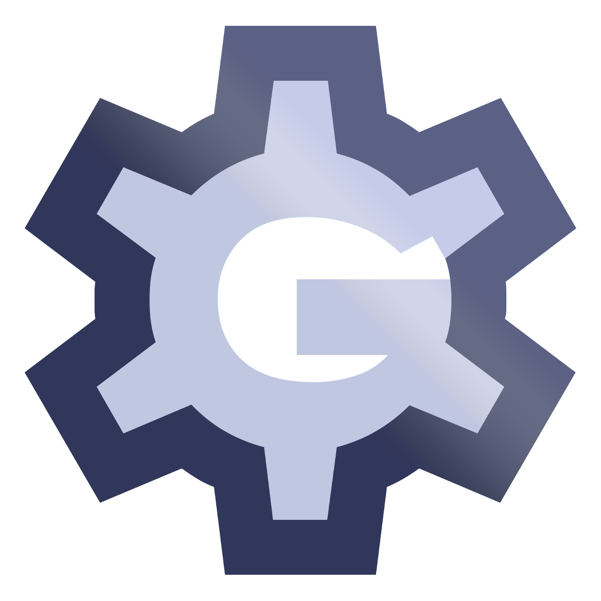

# Glare 
- A modular, cross-platform 3D game engine built in Kotlin using LWJGL and OpenGL

## TODO
- [ ] Add dependencies to components, so that they can only exist or maybe be run/started with it's requirements

## Dependencies and frameworks used
- Java 22
- [LWJGL 3.3.3](https://www.lwjgl.org/)
    - OpenGL 4.6
- [JOML 1.10.8](https://github.com/JOML-CI/JOML)
- [Obj 0.4.0](https://github.com/javagl/Obj)
- [ImGui Java 1.86.11](https://github.com/SpaiR/imgui-java)

## Additional Setup
- Generate Constants
```bash
./gradlew generateConstants
```

## Building
- Generates a `glare-editor` and `glare-engine`
```
./gradlew build
```

## Example Usage
- Example is probably already outdated.
```kotlin
fun main() {
    val config = EngineConfig(
        title = "Glare GE",
        windowWidth = 1280,
        windowHeight = 720,
        maximized = false,
        vSync = false,
        fov = 70.0f,
    )

    Engine(config, TestGame())
}

class TestGame : IScript {
    lateinit var engine: Engine

    override fun init(root: Node) {
        engine= root.engine

        val camera = Node.builder {
            name = "Freecam"
            transform = Transform(Vector3d(0.0, 5.0, 5.0), Euler(0.0, 0.0, -90.0))
            parent = root
            components = mutableListOf(
                CameraComponent(),
                ScriptsComponent(mutableListOf(FreecamScript())),
            )
        }

        engine.setCamera(camera)

        Node.builder {
            name = "Node"
            transform = Transform(0.0, 0.0, -5.0)
            parent = root
            components = mutableListOf(
                MeshComponent("/model/cube.obj"),
                TextureComponent("texture/map.png"),
                MaterialComponent(),
                ShaderComponent.Builder()
                    .vertex("/shader/mesh.vert")
                    .fragment("/shader/mesh.frag")
                    .build()
            )
        }
    }

    override fun update(delta: Double) {
        val node = engine.root.getFirstChild("Node")
        node!!.transform.rotation.addYaw(100.0 * delta)
    }
}
```

## License
Licensed under the MIT License; please see the [license file](LICENSE) for terms.
